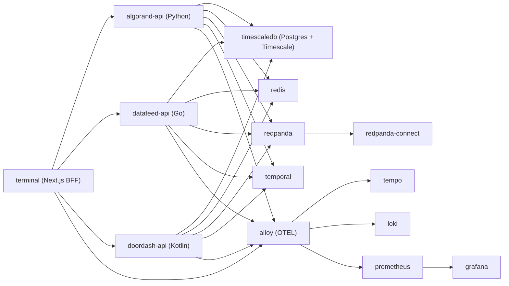

# Quantum Monorepo

Production-style multi-service trading/research platform scaffold with protobuf-first contracts, Temporal workers, streaming/event infrastructure, and an operations stack suitable for local on-prem style development.

For a shorter setup flow, see [QUICKSTART.md](./QUICKSTART.md).

## What This Repo Contains

- `api`: canonical protobuf and code generation workspace (Buf)
- `algorand`: Python 3.14 service for backtesting, analytics, ML, features, technical analysis, signals, and alerts
- `datafeed`: Go 1.26 service for market/news/social ingestion and replay (sqlc + pgx + golang-migrate)
- `doordash`: Kotlin service for order management and Drools-based risk gating (Ktor + jOOQ + Flyway)
- `terminal`: Next.js (App Router) admin dashboard + BFF proxy using ConnectRPC clients
- `infra`: infrastructure configs for compose, observability, bootstrap, and service registration

## Architecture



## Monorepo Layout

```text
quantum/
├── algorand/                # Python service
├── datafeed/                # Go service
├── doordash/                # Kotlin service
├── terminal/                # Next.js dashboard + BFF
├── api/                     # Canonical protobuf + codegen
│   ├── proto/
│   │   ├── algorand/v1/
│   │   ├── datafeed/v1/
│   │   ├── doordash/v1/
│   │   └── common/v1/
│   └── gen/openapi/
├── infra/                   # ops/infra configs (consul, grafana, loki, tempo, etc.)
├── docker-compose.yml       # Single local stack entrypoint
├── .env.example
└── Makefile
```

## Service Contracts and API Docs

- Protobuf source of truth: `api/proto`
- Codegen command: `./api/scripts/generate.sh`
- Generated OpenAPI artifacts:
  - `api/gen/openapi/quantum.openapi.yml`
  - `api/gen/openapi/quantum.openapi.json`
- Scalar API docs:
  - Algorand: [http://localhost:8080/scalar](http://localhost:8080/scalar)
  - Datafeed: [http://localhost:8081/scalar](http://localhost:8081/scalar)
  - Doordash: [http://localhost:8082/scalar](http://localhost:8082/scalar)

Note: OpenAPI generation currently uses Buf remote plugin `buf.build/community/sudorandom-connect-openapi:v0.25.4`, so `buf.build` access is required during `make generate`.

## Data and Persistence Model

- Single Postgres/Timescale cluster (`timescaledb`)
- Service schemas:
  - `algorand`
  - `datafeed`
  - `doordash`
- Additional databases created at bootstrap:
  - `airflow`
  - `temporal`
  - `temporal_visibility`
  - `casdoor`
- DuckDB is owned by `algorand` for local ML/data-engineering artifacts

### Datafeed Timescale tables

- `datafeed.ticks` (hypertable)
- `datafeed.bars_1m` (hypertable + compression policy)
- `datafeed.bars_5m` (hypertable + compression policy)
- `datafeed.news_events`
- `datafeed.social_events`
- `datafeed.ingest_offsets`

Default retention/compression from migrations:

- raw `ticks` retention: 30 days
- `bars_1m`/`bars_5m` compression enabled after 7 days

## Eventing and Job Orchestration

- Redis: cache + PubSub + Streams
- Redpanda: Kafka-compatible event bus
- Redpanda Connect: consumes `datafeed.ticks`, emits `datafeed.ticks.enriched`
- Temporal:
  - one worker process per backend service
  - schema and DB init is performed by `temporal-admin-tools` (single init container)

## Config, Secrets, and Auth

- Consul: runtime config KV
- Vault: API keys/secrets (KV v2)
- Casdoor + Casbin: user/authn and RBAC baseline
- Consul service registration JSONs live under `infra/consul/services`

Terraform bootstrap (recommended):

```bash
cd infra/terraform
terraform init -backend-config=environments/dev/backend.hcl.example
terraform apply
```

This automates:

- Docker Compose deployment
- Consul/Vault seeding
- Postgres user/database/schema bootstrap
- Temporal namespace + Redpanda topic + MinIO bucket bootstrap
- Casdoor OIDC redirect URI initialization

Legacy script-only seed (optional fallback):

```bash
./infra/bootstrap/seed-consul-vault.sh
```

Note: this script only seeds Consul/Vault. It does not perform ordered runtime
bootstrap for Temporal namespaces, Redpanda topics, MinIO buckets, or Casdoor OIDC redirect URIs.

## Observability Stack

- OTEL ingestion/routing: `alloy`
- Metrics: `prometheus`
- Logs: `loki`
- Traces: `tempo`
- Dashboards: `grafana` (pre-provisioned datasources)

## Quick Start

### Prerequisites

- Docker + Docker Compose
- Terraform 1.7+
- `buf` CLI
- Optional local workflows:
  - `uv` (Python)
  - Go 1.26+
  - Node 22+ + pnpm
  - Java 25 + Gradle

### Start everything

```bash
cp .env.example .env
make tf-init
make tf-apply
```

### Common Make targets

```bash
make help
make bootstrap
make generate
make up
make tf-init
make tf-plan
make tf-apply
make logs
make lint
make test
make down
make down-v
```

## Endpoints and Ports

### Application services

- Terminal: `http://localhost:3000`
- Algorand API: `http://localhost:8080`
- Datafeed API: `http://localhost:8081`
- Doordash API: `http://localhost:8082`

### Infrastructure and UIs

- TimescaleDB: `localhost:5432`
- Redis: `localhost:6379`
- Redpanda (external Kafka): `localhost:19092`
- Redpanda admin: `localhost:9644`
- Redpanda Console: `http://localhost:8089`
- Redpanda Connect: `http://localhost:4195`
- MinIO API: `http://localhost:9000`
- MinIO Console: `http://localhost:9001`
- Consul UI: `http://localhost:8500`
- Vault: `http://localhost:8200`
- Casdoor: `http://localhost:8000`
- PgAdmin: `http://localhost:5050`
- RedisInsight: `http://localhost:5540`
- Feast UI: `http://localhost:6567`
- Airflow UI: `http://localhost:8087`
- MLflow UI: `http://localhost:5001`
- DuckDB UI (host mode): `http://localhost:4213`
- Temporal gRPC: `localhost:7233`
- Temporal UI: `http://localhost:8088`
- Alloy OTLP: `localhost:4317`/`localhost:4318`
- Alloy metrics/debug: `http://localhost:12345`
- Prometheus: `http://localhost:9090`
- Loki: `http://localhost:3100`
- Tempo: `http://localhost:3200`
- Grafana: `http://localhost:3001` (`admin`/`admin`)

## Development Workflows

### Regenerate contracts

```bash
make generate
```

### Run tests

```bash
make test
```

### Lint and format

```bash
make lint
make fmt
```

Tooling highlights:

- `algorand`: Ruff + Pytest
- `datafeed`: golangci-lint + Go tests
- `doordash`: Gradle test
- `terminal`: oxlint/oxfmt + vitest

## Notes on Container Builds

- `terminal` depends on TradingView `charting_library` via GitHub and uses SSH during Docker build.
- Compose passes SSH into terminal build (`build.ssh: default`), so you need a running SSH agent with GitHub access.

## Troubleshooting

### `.env` missing

```bash
cp .env.example .env
```

### OpenAPI file not generated

- Run `make generate`.
- Confirm network access to `buf.build` (remote plugin fetch is required).

### Terminal build fails fetching `charting_library`

- Ensure `ssh-agent` is running and key is loaded.
- Ensure GitHub SSH access works (`git@github.com:tradingview/charting_library.git`).

### Temporal fails to start due missing schema

- Check `temporal-admin-tools` logs first.
- Ensure `timescaledb` is healthy before Temporal startup.

### Airflow UI does not open

- Wait for full `airflow standalone` init on first boot.
- Check `airflow` container logs for stale pid or startup errors.

## Image Tag Policy

- Monitoring/OTEL-related containers use `latest` tags:
  - `grafana/alloy`, `prom/prometheus`, `grafana/loki`, `grafana/tempo`, `grafana/grafana`, `temporalio/ui`
  - `minio/minio`
- Other infrastructure/services are pinned or major-tag pinned as configured.
- Example major pin policy: `redis:8`.
